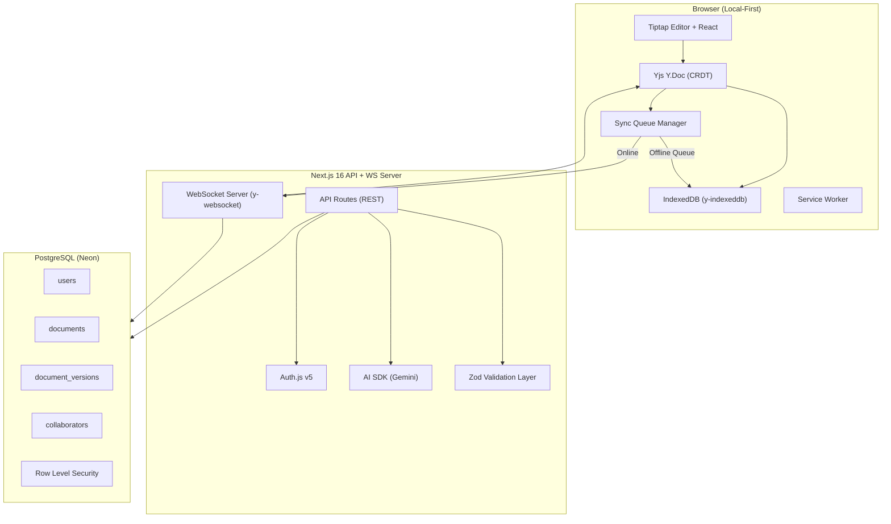

# Local-First Collaborative Document Editor — "SyncScribe"

A production-grade, local-first collaborative document editor with offline synchronization, CRDT-based deterministic conflict resolution, granular version control, role-based access, and AI-powered features.

---

## User Review Required

> [!IMPORTANT]
> **Database Hosting**: This plan uses **Neon PostgreSQL** (free tier, serverless) for deployment. If you prefer a different provider (Supabase, Railway, etc.), let me know before I proceed.

> [!IMPORTANT]
> **AI Provider**: The plan uses **Google Gemini** via the Vercel AI SDK for AI features (summarization, writing assistance). If you prefer OpenAI or Groq, let me know.

> [!IMPORTANT]
> **Auth Provider**: Using **Auth.js v5** with GitHub + Google OAuth + Credentials (email/password) login. Confirm if these providers work for you.

> [!WARNING]
> **Deployment**: The plan targets **Vercel** for frontend/API and a lightweight **WebSocket server** (e.g., on Railway or Render) for real-time collaboration. Vercel doesn't support persistent WebSocket connections natively, so the WS server must be hosted separately.

## Open Questions

1. **Your Name & Profiles**: What is your full name, GitHub profile URL, and LinkedIn profile URL for the footer?
2. **Domain**: Do you have a custom domain, or should we use the default Vercel `.vercel.app` subdomain?
3. **AI API Key**: Do you already have an API key for Gemini/OpenAI/Groq, or should I design the app to work gracefully without one (with a config screen)?

---

## Architecture Overview



### Key Architectural Decisions

| Decision | Choice | Rationale |
|---|---|---|
| **CRDT Engine** | **Yjs** | Industry standard, battle-tested, native Tiptap integration, deterministic merge |
| **Editor** | **Tiptap v2** | ProseMirror-based, first-class Yjs/collaboration support, extensible |
| **Local Storage** | **IndexedDB via y-indexeddb** | Persistent offline CRDT state, survives tab close |
| **Real-time Sync** | **y-websocket** | Native Yjs protocol, binary-efficient, handles reconnection |
| **ORM** | **Drizzle ORM** | Type-safe, lightweight, supports RLS, PostgreSQL-native |
| **Auth** | **Auth.js v5** | Next.js native, edge-compatible, JWT-based |
| **AI** | **Vercel AI SDK + Gemini** | Structured outputs, streaming, server actions |
| **UI Framework** | **shadcn/ui + Tailwind CSS v4** | Ownership model, Radix primitives, accessible |
| **Styling** | **Tailwind CSS v4** | As required by the assignment |

---

## Proposed Changes

### 1. Project Scaffolding & Configuration

#### [NEW] Project initialization
- `npx create-next-app@latest ./` with TypeScript, Tailwind CSS, App Router, ESLint
- `npx shadcn@latest init` with `new-york` style
- Install all dependencies in one batch

**Core Dependencies:**
```
# CRDT & Editor
yjs y-websocket y-indexeddb @tiptap/react @tiptap/starter-kit
@tiptap/extension-collaboration @tiptap/extension-collaboration-cursor
@tiptap/extension-placeholder @tiptap/extension-highlight
@tiptap/extension-task-list @tiptap/extension-task-item
@tiptap/extension-typography @tiptap/extension-underline
@tiptap/extension-text-align @tiptap/extension-code-block-lowlight

# Database & ORM
drizzle-orm @neondatabase/serverless
drizzle-kit (dev)

# Auth
next-auth@beta @auth/drizzle-adapter

# AI
ai @ai-sdk/google

# Validation
zod

# UI (via shadcn)
shadcn components: button, card, dialog, dropdown-menu, avatar,
badge, separator, tooltip, scroll-area, sheet, skeleton,
alert-dialog, input, label, tabs, popover, command, sonner

# Utilities
date-fns uuid nanoid clsx tailwind-merge
lucide-react @radix-ui/react-icons
```

#### [NEW] Configuration Files
- `drizzle.config.ts` — Drizzle Kit configuration for migrations
- `auth.ts` — Auth.js v5 centralized config
- `auth.config.ts` — Edge-compatible auth config (for proxy.ts)
- `proxy.ts` — Next.js 16 route protection (replaces middleware.ts)
- `.env.local.example` — Environment variable template

---

### 2. Database Schema (Drizzle ORM + PostgreSQL)

#### [NEW] [schema.ts](file:///c:/Abhishek/Assignment/houseofedtech/src/db/schema.ts)

**Tables:**

| Table | Purpose | Key Columns |
|---|---|---|
| `users` | User accounts (Auth.js managed) | `id`, `name`, `email`, `image`, `password_hash` |
| `accounts` | OAuth accounts (Auth.js) | `provider`, `provider_account_id`, `user_id` |
| `sessions` | Active sessions | `session_token`, `user_id`, `expires` |
| `documents` | Document metadata | `id`, `title`, `owner_id`, `created_at`, `updated_at`, `is_public` |
| `document_versions` | Version snapshots | `id`, `document_id`, `version_number`, `snapshot` (binary Yjs state), `title`, `created_by`, `created_at` |
| `collaborators` | Access control | `document_id`, `user_id`, `role` (owner/editor/viewer), `invited_at` |
| `sync_log` | Audit trail for sync events | `id`, `document_id`, `user_id`, `action`, `payload_size`, `timestamp` |

**Security:**
- Row Level Security (RLS) policies on `documents`, `document_versions`, `collaborators`
- Users can only SELECT/UPDATE/DELETE documents they own or are collaborators on
- Viewers cannot INSERT into `document_versions` or `sync_log` with write actions
- Payload size limits enforced at application layer AND database constraints

#### [NEW] [migrations/](file:///c:/Abhishek/Assignment/houseofedtech/src/db/migrations/)
- Auto-generated by `drizzle-kit generate`

---

### 3. Authentication & Authorization

#### [NEW] [auth.ts](file:///c:/Abhishek/Assignment/houseofedtech/auth.ts)
- Auth.js v5 with Drizzle adapter
- Providers: GitHub OAuth, Google OAuth, Credentials (email + bcrypt password)
- JWT strategy with custom claims (`userId`, `role`)
- Session callback to expose `user.id` in client-side session

#### [NEW] [proxy.ts](file:///c:/Abhishek/Assignment/houseofedtech/proxy.ts)
- Route protection: redirect unauthenticated users from `/dashboard`, `/editor/*` to `/auth/signin`
- Public routes: `/`, `/auth/*`, `/api/auth/*`

#### [NEW] [src/lib/authorization.ts](file:///c:/Abhishek/Assignment/houseofedtech/src/lib/authorization.ts)
- `checkDocumentAccess(userId, documentId, requiredRole)` — granular role check
- Roles: `owner` > `editor` > `viewer`
- Enforced in every API route and Server Action
- WebSocket connection handshake validates JWT and role before allowing sync

---

### 4. Local-First CRDT Engine

#### [NEW] [src/lib/crdt/yjs-provider.ts](file:///c:/Abhishek/Assignment/houseofedtech/src/lib/crdt/yjs-provider.ts)
- Creates and manages `Y.Doc` instances per document
- Configures `y-indexeddb` provider for persistent local storage
- Configures `y-websocket` provider for server sync (when online)
- Handles provider lifecycle (connect, disconnect, destroy)

#### [NEW] [src/lib/crdt/sync-manager.ts](file:///c:/Abhishek/Assignment/houseofedtech/src/lib/crdt/sync-manager.ts)
- **Connection Status Monitor**: Listens to `navigator.onLine`, WebSocket state, and custom heartbeat
- **Offline Queue**: When offline, captures Yjs update vectors and stores in IndexedDB
- **Reconnection Strategy**: Exponential backoff with jitter
- **Conflict Resolution**: Yjs CRDT handles this deterministically — concurrent edits are merged without data loss using Lamport timestamps and unique client IDs
- **State Sync Flow**:
  1. User edits → Yjs applies to local Y.Doc → persisted to IndexedDB immediately
  2. If online → y-websocket pushes binary update to server
  3. If offline → updates accumulate in Y.Doc (already in IndexedDB)
  4. On reconnect → y-websocket automatically syncs full state vector diff

#### [NEW] [src/lib/crdt/awareness.ts](file:///c:/Abhishek/Assignment/houseofedtech/src/lib/crdt/awareness.ts)
- Manages collaborative presence: cursor positions, user selections, online status
- Shows colored cursors with user names in the editor
- Awareness data is ephemeral (not persisted)

---

### 5. Version History & Time Travel

#### [NEW] [src/lib/versioning/version-manager.ts](file:///c:/Abhishek/Assignment/houseofedtech/src/lib/versioning/version-manager.ts)
- **Snapshot Capture**: Encodes full Yjs state as binary (`Y.encodeStateAsUpdate(ydoc)`) and stores in PostgreSQL
- **Version Listing**: Fetches ordered list of snapshots with metadata (who created, when, title)
- **Time Travel / Preview**: Creates a temporary `Y.Doc`, applies the historical snapshot, renders in read-only Tiptap instance — does NOT modify the current shared document
- **Restore**: Creates a NEW version by applying the historical state as a new update to the live document — preserves all history, no corruption

#### [NEW] [src/components/version-history/](file:///c:/Abhishek/Assignment/houseofedtech/src/components/version-history/)
- `VersionTimeline.tsx` — Visual timeline of document versions
- `VersionPreview.tsx` — Side-by-side or overlay preview of past versions
- `VersionDiff.tsx` — Visual diff between current and historical version
- `CreateSnapshotDialog.tsx` — Named snapshot creation with description

---

### 6. WebSocket Collaboration Server

#### [NEW] [server/ws-server.ts](file:///c:/Abhishek/Assignment/houseofedtech/server/ws-server.ts)
- Standalone Node.js WebSocket server using `y-websocket` utilities
- **Authentication**: Validates JWT token from connection URL params before upgrading
- **Authorization**: Checks user role — viewers get read-only sync (receive updates, cannot push)
- **Payload Validation**: 
  - Max payload size: 1MB per message (configurable)
  - Rate limiting: Max 100 messages/second per client
  - Malformed binary detection: Validates Yjs update structure before applying
- **Persistence**: Periodically saves Y.Doc state to PostgreSQL (debounced, every 30s or on last client disconnect)
- **Anti-OOM Protection**:
  - Per-document memory limit tracking
  - Document size growth rate monitoring
  - Automatic rejection of updates that would exceed thresholds
  - Graceful degradation: warns users before hard-limiting

#### [NEW] [server/rate-limiter.ts](file:///c:/Abhishek/Assignment/houseofedtech/server/rate-limiter.ts)
- Token bucket algorithm per client connection
- Prevents flooding attacks

---

### 7. Document Editor UI

#### [NEW] [src/components/editor/](file:///c:/Abhishek/Assignment/houseofedtech/src/components/editor/)

| Component | Purpose |
|---|---|
| `CollaborativeEditor.tsx` | Main editor wrapper — initializes Yjs, Tiptap, providers |
| `EditorToolbar.tsx` | Rich text formatting toolbar (bold, italic, headings, lists, code, etc.) |
| `EditorBubbleMenu.tsx` | Floating format menu on text selection |
| `ConnectionStatus.tsx` | Real-time indicator: 🟢 Online / 🟡 Syncing / 🔴 Offline |
| `CollaboratorAvatars.tsx` | Shows active collaborators with colored dots |
| `DocumentTitle.tsx` | Inline-editable document title |
| `AIAssistPanel.tsx` | Side panel for AI features |

**Editor Extensions:**
- StarterKit (bold, italic, strike, code, headings, lists, blockquote, horizontal rule)
- Collaboration (Yjs integration)
- CollaborationCursor (multi-user cursors)
- Placeholder
- TaskList + TaskItem
- Highlight
- Underline
- TextAlign
- CodeBlockLowlight (syntax highlighting)
- Typography (smart quotes, etc.)

**Performance Optimizations:**
- `React.memo` on toolbar and status components to prevent re-renders during typing
- Debounced title sync (300ms)
- Editor content is NOT in React state — Yjs manages it directly (zero React re-renders on keystrokes)

---

### 8. Pages & Routing

#### [NEW] [src/app/(public)/page.tsx](file:///c:/Abhishek/Assignment/houseofedtech/src/app/(public)/page.tsx)
- Landing page with hero section, feature highlights, tech stack showcase
- Animated gradient backgrounds, glassmorphism cards
- CTA buttons to sign in / get started

#### [NEW] [src/app/auth/signin/page.tsx](file:///c:/Abhishek/Assignment/houseofedtech/src/app/auth/signin/page.tsx)
- Sign in with GitHub, Google, or email/password
- Beautiful auth card with animated background

#### [NEW] [src/app/auth/signup/page.tsx](file:///c:/Abhishek/Assignment/houseofedtech/src/app/auth/signup/page.tsx)
- Registration form with validation

#### [NEW] [src/app/dashboard/page.tsx](file:///c:/Abhishek/Assignment/houseofedtech/src/app/dashboard/page.tsx)
- Document list (owned + shared with me)
- Create new document button
- Search and filter documents
- Document cards showing: title, last edited, collaborator count, your role
- Connection status banner

#### [NEW] [src/app/editor/[documentId]/page.tsx](file:///c:/Abhishek/Assignment/houseofedtech/src/app/editor/[documentId]/page.tsx)
- Full-screen collaborative editor
- Sidebar for version history and AI panel
- Share dialog for inviting collaborators with role selection
- Auto-save indicator

#### [NEW] [src/app/editor/[documentId]/versions/page.tsx](file:///c:/Abhishek/Assignment/houseofedtech/src/app/editor/[documentId]/versions/page.tsx)
- Full version history timeline view
- Side-by-side diff viewer

---

### 9. AI Features (Vercel AI SDK + Gemini)

#### [NEW] [src/app/api/ai/route.ts](file:///c:/Abhishek/Assignment/houseofedtech/src/app/api/ai/route.ts)
- Server-side AI endpoint with streaming

#### [NEW] [src/lib/ai/actions.ts](file:///c:/Abhishek/Assignment/houseofedtech/src/lib/ai/actions.ts)
Server Actions for AI features:

| Feature | Description |
|---|---|
| **Summarize** | Generate a concise summary of the current document |
| **Continue Writing** | AI continues writing from the cursor position |
| **Improve Writing** | Rewrite selected text for clarity, grammar, tone |
| **Translate** | Translate selected text to another language |
| **Explain** | Explain complex text in simpler terms |
| **Generate Outline** | Create a structured outline from a topic |
| **Fix Grammar** | Correct grammar and spelling in selection |

Each action validates input length (max 10,000 chars), authenticates the user, and uses structured Zod schemas for consistent output.

---

### 10. API Routes

#### [NEW] [src/app/api/documents/route.ts](file:///c:/Abhishek/Assignment/houseofedtech/src/app/api/documents/route.ts)
- `GET` — List user's documents (owned + collaborated)
- `POST` — Create new document (with Zod validation)

#### [NEW] [src/app/api/documents/[id]/route.ts](file:///c:/Abhishek/Assignment/houseofedtech/src/app/api/documents/[id]/route.ts)
- `GET` — Get document metadata + check access
- `PATCH` — Update document metadata (title, public flag)
- `DELETE` — Delete document (owner only)

#### [NEW] [src/app/api/documents/[id]/versions/route.ts](file:///c:/Abhishek/Assignment/houseofedtech/src/app/api/documents/[id]/versions/route.ts)
- `GET` — List versions with pagination
- `POST` — Create named snapshot (with binary payload size limit: 5MB)

#### [NEW] [src/app/api/documents/[id]/versions/[versionId]/route.ts](file:///c:/Abhishek/Assignment/houseofedtech/src/app/api/documents/[id]/versions/[versionId]/route.ts)
- `GET` — Get specific version snapshot
- `POST /restore` — Restore document to this version

#### [NEW] [src/app/api/documents/[id]/collaborators/route.ts](file:///c:/Abhishek/Assignment/houseofedtech/src/app/api/documents/[id]/collaborators/route.ts)
- `GET` — List collaborators
- `POST` — Invite collaborator (by email, with role)
- `PATCH` — Update collaborator role
- `DELETE` — Remove collaborator

**All routes include:**
- Auth check via `auth()` 
- Zod request validation
- Role-based authorization
- Error handling with structured error responses
- Payload size limits

---

### 11. Security Architecture

#### Payload Validation & Anti-OOM
```
Client → [Size Check: max 1MB] → [Rate Limiter: 100 msg/s] → 
  [Binary Structure Validation] → [Yjs Update Application] → 
  [Doc Size Check: max 50MB] → Accept/Reject
```

#### API Security
- All API routes require authentication (JWT)
- Zod validation on all request bodies with `maxLength` constraints
- CSRF protection via Auth.js
- Rate limiting on AI endpoints (10 requests/minute/user)
- Input sanitization for XSS prevention

#### Database Security
- RLS policies on all tenant-scoped tables
- Drizzle ORM scoping: all queries include `where userId = currentUser`
- Prepared statements (SQL injection prevention via Drizzle)
- Binary snapshot size column constraint (max 50MB)

#### WebSocket Security
- JWT validation on connection upgrade
- Role enforcement (viewers = read-only)
- Per-client rate limiting
- Payload size limits
- Connection timeout (idle disconnect after 30min)

---

### 12. UI/UX Design System

**Theme:**
- Dark mode primary with light mode support
- Color palette: Deep indigo/violet primary (#6366f1), with emerald accents
- OKLCH color space (Tailwind v4 + shadcn)
- Glassmorphism cards with backdrop-blur
- Subtle gradient backgrounds
- Smooth micro-animations (Tailwind transitions + CSS keyframes)

**Typography:**
- Inter (body text) + JetBrains Mono (code blocks)
- Google Fonts loaded via `next/font`

**Accessibility:**
- All interactive elements have focus-visible outlines
- ARIA labels on icon buttons
- Keyboard navigation throughout
- Screen reader announcements for sync status changes
- Color contrast ratios ≥ 4.5:1
- Reduced motion support via `prefers-reduced-motion`

---

### 13. Deployment & CI/CD

#### Vercel Deployment
- Frontend + API routes on Vercel
- Environment variables configured in Vercel dashboard
- Automatic deployments from `main` branch

#### WebSocket Server
- Separate Node.js process deployed to **Railway** or **Render** (free tier)
- Connected via `NEXT_PUBLIC_WS_URL` environment variable

#### CI/CD (GitHub Actions)
#### [NEW] [.github/workflows/ci.yml](file:///c:/Abhishek/Assignment/houseofedtech/.github/workflows/ci.yml)
- Lint (ESLint)
- Type check (tsc --noEmit)
- Build verification
- Auto-deploy to Vercel on push to `main`

---

### 14. Testing Strategy

#### [NEW] [src/__tests__/](file:///c:/Abhishek/Assignment/houseofedtech/src/__tests__/)

| Test Type | Tool | Coverage |
|---|---|---|
| **Unit** | Vitest | Sync manager, version manager, authorization logic, payload validation |
| **Integration** | Vitest + Drizzle test utils | API routes, database operations, auth flows |
| **E2E** | Playwright | Full user flows: create doc → edit → go offline → come back → verify sync |

Key test scenarios:
- Offline edit → reconnect → verify no data loss
- Concurrent edits from 2 clients → verify deterministic merge
- Viewer attempting write → verify rejection
- Malformed WebSocket payload → verify server doesn't crash
- Version restore → verify other collaborators see update

---

## File Structure

```
houseofedtech/
├── .github/workflows/ci.yml
├── server/
│   ├── ws-server.ts          # Standalone WebSocket server
│   └── rate-limiter.ts
├── src/
│   ├── app/
│   │   ├── (public)/
│   │   │   └── page.tsx      # Landing page
│   │   ├── auth/
│   │   │   ├── signin/page.tsx
│   │   │   └── signup/page.tsx
│   │   ├── dashboard/
│   │   │   └── page.tsx
│   │   ├── editor/
│   │   │   └── [documentId]/
│   │   │       ├── page.tsx
│   │   │       └── versions/page.tsx
│   │   ├── api/
│   │   │   ├── auth/[...nextauth]/route.ts
│   │   │   ├── documents/
│   │   │   │   ├── route.ts
│   │   │   │   └── [id]/
│   │   │   │       ├── route.ts
│   │   │   │       ├── versions/
│   │   │   │       │   ├── route.ts
│   │   │   │       │   └── [versionId]/route.ts
│   │   │   │       └── collaborators/route.ts
│   │   │   └── ai/route.ts
│   │   ├── layout.tsx
│   │   └── globals.css
│   ├── components/
│   │   ├── ui/               # shadcn components
│   │   ├── editor/
│   │   │   ├── CollaborativeEditor.tsx
│   │   │   ├── EditorToolbar.tsx
│   │   │   ├── EditorBubbleMenu.tsx
│   │   │   ├── ConnectionStatus.tsx
│   │   │   ├── CollaboratorAvatars.tsx
│   │   │   ├── DocumentTitle.tsx
│   │   │   └── AIAssistPanel.tsx
│   │   ├── version-history/
│   │   │   ├── VersionTimeline.tsx
│   │   │   ├── VersionPreview.tsx
│   │   │   ├── VersionDiff.tsx
│   │   │   └── CreateSnapshotDialog.tsx
│   │   ├── dashboard/
│   │   │   ├── DocumentCard.tsx
│   │   │   ├── DocumentList.tsx
│   │   │   ├── CreateDocumentDialog.tsx
│   │   │   └── ShareDialog.tsx
│   │   ├── layout/
│   │   │   ├── Navbar.tsx
│   │   │   ├── Footer.tsx
│   │   │   └── Sidebar.tsx
│   │   └── auth/
│   │       ├── SignInForm.tsx
│   │       └── SignUpForm.tsx
│   ├── db/
│   │   ├── index.ts          # Drizzle client
│   │   ├── schema.ts         # Full schema
│   │   └── migrations/
│   ├── lib/
│   │   ├── crdt/
│   │   │   ├── yjs-provider.ts
│   │   │   ├── sync-manager.ts
│   │   │   └── awareness.ts
│   │   ├── versioning/
│   │   │   └── version-manager.ts
│   │   ├── ai/
│   │   │   └── actions.ts
│   │   ├── authorization.ts
│   │   ├── validators.ts     # Zod schemas
│   │   └── utils.ts
│   ├── hooks/
│   │   ├── useYjsDocument.ts
│   │   ├── useConnectionStatus.ts
│   │   ├── useDocumentVersions.ts
│   │   └── useCollaborators.ts
│   └── __tests__/
│       ├── unit/
│       ├── integration/
│       └── e2e/
├── auth.ts
├── auth.config.ts
├── proxy.ts
├── drizzle.config.ts
├── package.json
├── tsconfig.json
├── next.config.ts
└── .env.local.example
```

---

## Verification Plan

### Automated Tests
```bash
# Unit & Integration tests
npm run test

# E2E tests
npx playwright test

# Type checking
npx tsc --noEmit

# Lint
npm run lint
```

### Manual Verification
1. **Offline Sync Test**: Open editor → type content → disable network (DevTools) → continue typing → re-enable network → verify content appears on server and other tabs
2. **Conflict Resolution Test**: Open same document in 2 browser tabs → type simultaneously in both → verify deterministic merge with no data loss
3. **Version History Test**: Create snapshots → browse timeline → preview old versions → restore a version → verify other collaborators see the restored state
4. **Role Authorization Test**: Share doc as viewer → attempt to type → verify read-only mode → change role to editor → verify editing works
5. **Security Test**: Send oversized WebSocket payload → verify server rejects it gracefully
6. **AI Features Test**: Select text → use summarize/improve/continue features → verify AI output is inserted correctly
7. **Responsive Design Test**: Check layout on mobile, tablet, and desktop viewports
